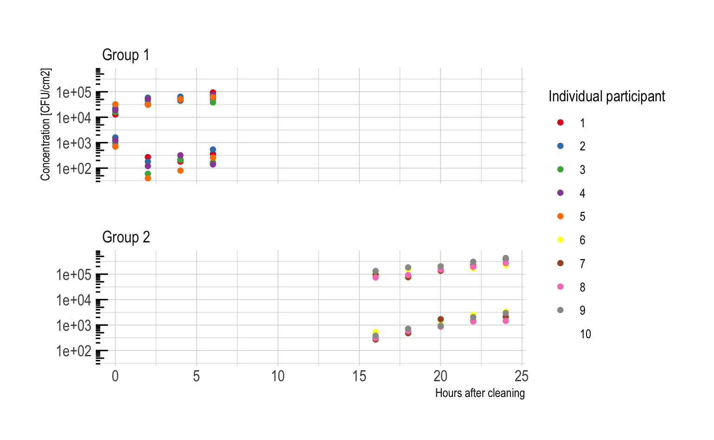

# Residual effect of a disinfectant on hand bacterial concentrations
## Experimental protocol
An experiment was carried out in a biological research facilitiy whre one hand from 10 people (left or right) was cleaned with a sanitiser. Their other hand was sampled as a control. Over the next 6 hours 5 participants hands' were sampled every hour for microorganisms, after which these 5 left. The other 5 participants (who had not been previously sampled but had been treated) were then sampled from hours 16 to 24 after sanitiser application.

## Results
The following graph shows the concentration of aerobic colony counts on participants' hand over time. The points are coloured by treatment group.

## Analysis

## Approximate Bayesian Computation - Parameter inference
We consider only recontamination from surface contacts, not from additional proliferation of the bacterias on the hands.
$$ y'=(1-\dfrac{y}{C})r-d\exp(-g t)y$$

$C$ is carrying capacity.$r$ is the scaling parameter for logistic growth representing the additional recontamination from surface contacts.

 $d$ is . $g$ is decay from the disinfectant.

# IMPORTANT - The above equation is wrong!
a y is missing before the logisitc growth rate

$$ y'=y*(1-\dfrac{y}{C})r-d\exp(-g t)y$$
#Fixed on 20th May

First part of the growth appears linear but after 16h it appears to be exponential
~                                                                       
